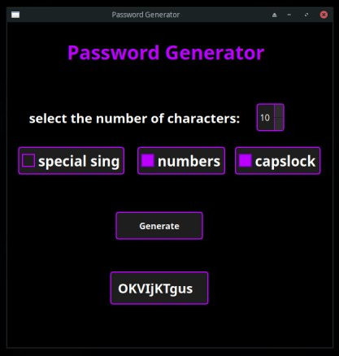

# Password Generator



**Password Generator** — это программа для генерации паролей, которая позволяет создавать пароли заданной длины с учетом выбранных параметров. В приложении реализован графический интерфейс, созданный с помощью Qt Designer.

## Функциональность

Программа генерирует пароли на основе следующих параметров:

- **Длина пароля**: Задать количество символов в пароле.
- **Специальные символы**: Опция для включения специальных символов в пароль.
- **Цифры**: Опция для включения цифр в пароль.
- **Капслок (большие буквы)**: Опция для включения заглавных букв в пароль.

Пользователь может выбрать нужные параметры через чекбоксы, и программа сгенерирует пароль в соответствии с этими параметрами.

## Требования

- Python 3.x
- PyQt5

## Установка

1. Клонируйте репозиторий:

    ```bash
    https://github.com/YanniszY/PassGenGui.git
    cd PassGenGui
    ```

2. Установите зависимости:

    ```bash
    pip install -r requirements.txt
    ```

   или используйте venv
    
    для Windows:
    ```bash
    activate venv/bin/activate
    ```
    для Linux:
    ```bash
    source venv/bin.activate
    ```

## Запуск

Для запуска программы используйте команду:

```bash
python main.py
```
## Использование

1. Введите желаемую длину пароля в соответствующее поле.
2. Выберите опции для включения специальных символов, цифр и заглавных букв, если необходимо.
3. Нажмите кнопку для генерации пароля, чтобы получить результат.

# Разработка

Для редактирования графического интерфейса использовался Qt Designer. Изменения в интерфейсе можно внести, отредактировав файлы ```.ui``` и сгенерировав Python код с помощью ```pyuic5```.
